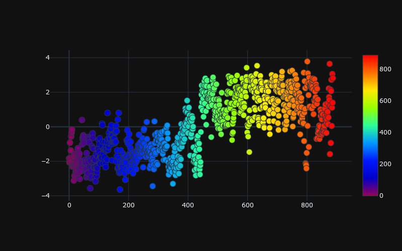

<h1 align = 'center'> Seizure Detection using Reinforcement Learning</h1>

The electroencephalogram (EEG) signals are commonly used for diagnosis of epilepsy. In this project we presented a method of electroencephalogram (EEG) signal classification using a reinforcement learning model. It is known that ictal(seizure) EEG signals have higher energy compared to non-ictal(seizure-free). So, these two parametres ictal and non-ictal, are given as inputs to train our model for classification using the Deep Reinforcement Learning approach and we perform the classification action on a sample at each time step and our model evaluates the classification action and returns a reward to the agent .For each good action agent will be awarded and will be punished for every bad action, try to gain maximum reward as sequential decision making process by applying Deep Q Network (DQN) algorithm. Now our trained mode can predict a set of eeg signals from seizure and seizure-free category.

## About the Project

- The task was to classify the ictal(seizure) and non-ictal(seizure-free) patients by Reinforcement learning. <b>Children HospitalBoston, Massachusetts Institute of Technology(CHB-MIT)</b> and <b>Bonn Datasets</b> are two publicly available datasets have been used in this project

  - <b> Extracting the Dataset: </b> I extracted the dataset into 71 Seizure and 71 Non-Seizure text files for all the 23 patients containing total recording of 2.5 hr.In the CHB-MIT dataset ,we extract the region of interest from the recordings or the incident when seizure actually happens in the 71 text files and same for non-seizure.After extraction we conclude 1136640/256 = 4440 sec or 74 min recordings of seizure and same 74 min of non-seizure data for all the 23 patients.
  
  - <b>Preprocessing: </b> Now for preprocessing, apply a <b> sixth order low pass butterworth filter with cut off frequency of 45.12 Hz </b>as our filter will pass only the frequencies having less than cutoff frequency and remove all the frequencies higher than cut off frequency. Here we have shown the figure below where you can clearly see that original signal have been smoothed after applying low pass filter.
  
  - <b>Feature Extraction: </b>Then after, we perform the feature extraction so there are 23 channels in our dataset and recording of 74 *2 = 148 min (8880 sec) for both seizure and non-seizure patients. for each channel, mainly calculated four features:<b> variance, standard deviation ,Shannon entropy and kurtosis</b>.Total 23*4 =92 features will be created for segment of every 10 sec ( 10*256 = 2560) signal. So 1136640/2560 = 444 rows will be created for 92 features for seizure data. After creating 444*92 matix for seizure and 444*92 for non*seizure, we perform <b>linear discriminant analysis</b> for reducing the 92 features into single features because more input features often make a predictive modelling task more challenging to model, more generally referred to as the curse of dimensionality.
  
  - <b> Deep Reinforcement Learning: </b> Now features are extracted and Now our agent is ready for training.Here we train our model using <b>Deep Q Network </b>, a standard Deep Reinforcement learning algorithm, a neural network, uses loss function and the predicted (current) Q value, Target Q value, and Observed reward to complete the loss to train the network and thus improve its thepredictions. 
  -

## System Requirements 
  -  Python Version : 3.8.6 
  -  Windows system with a 64 bit Operating system 
  -  16 Gb Ram 
  -  Intel(R) Core(TM) i5-10300H CPU @ 2.50GHz
  -  Geforce RTX 2060 6Gb GPU 
  -  CUDA version 11.0.
  -  It is recommended to have a GPU installed on your system.</i>
  
dataset link : https://physionet.org/content/chbmit/1.0.0/
